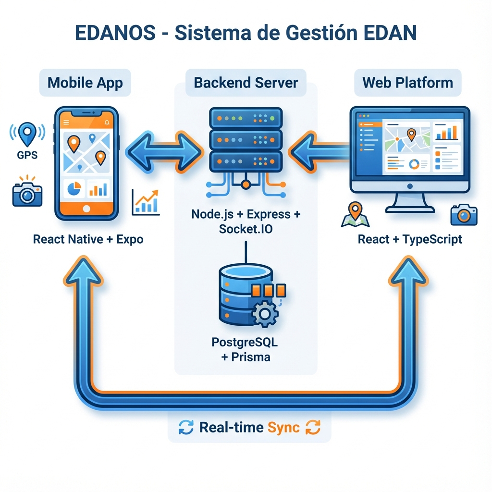
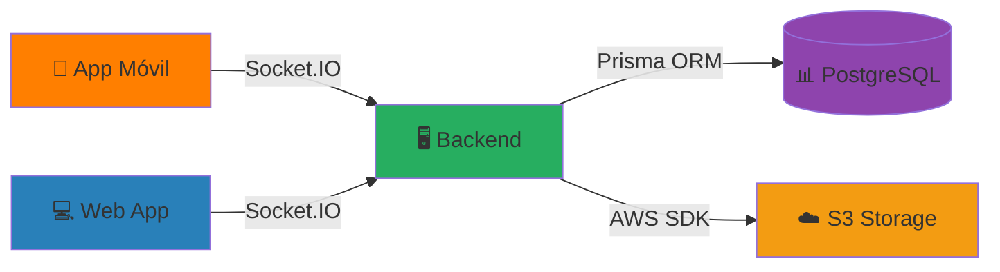
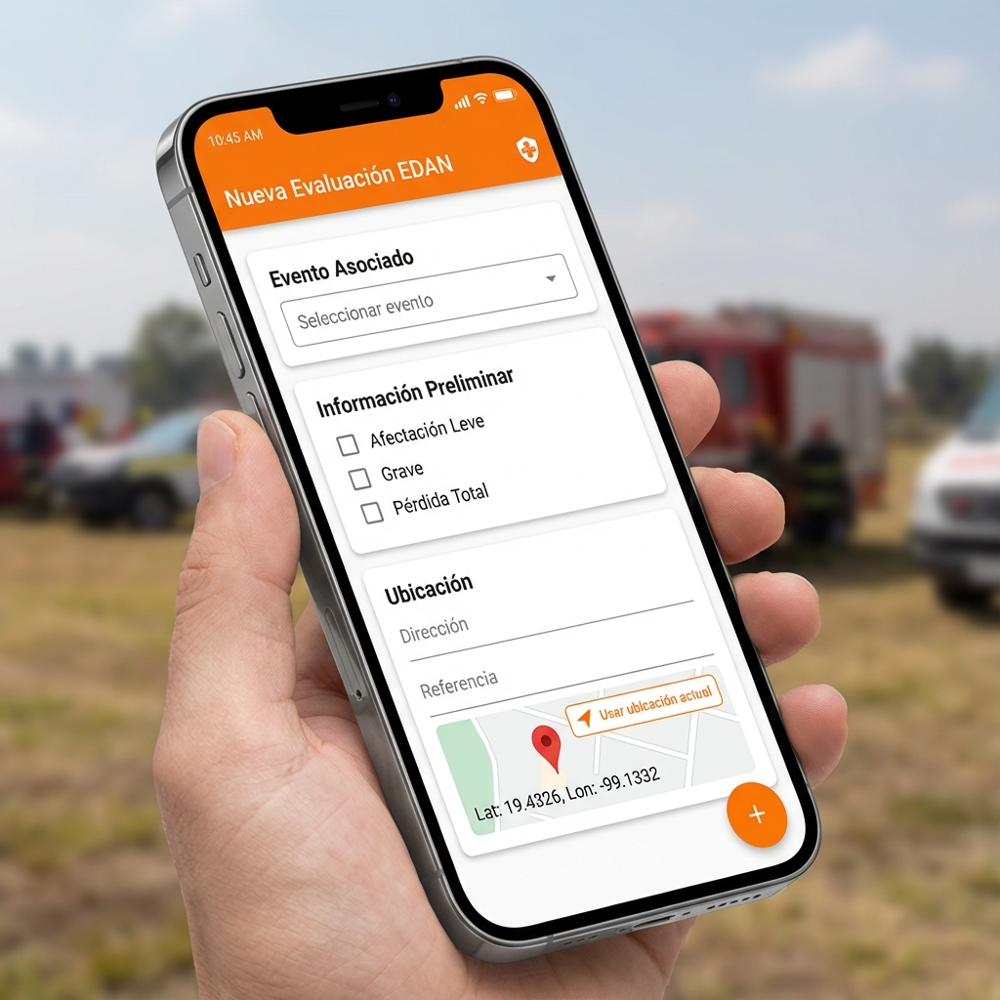
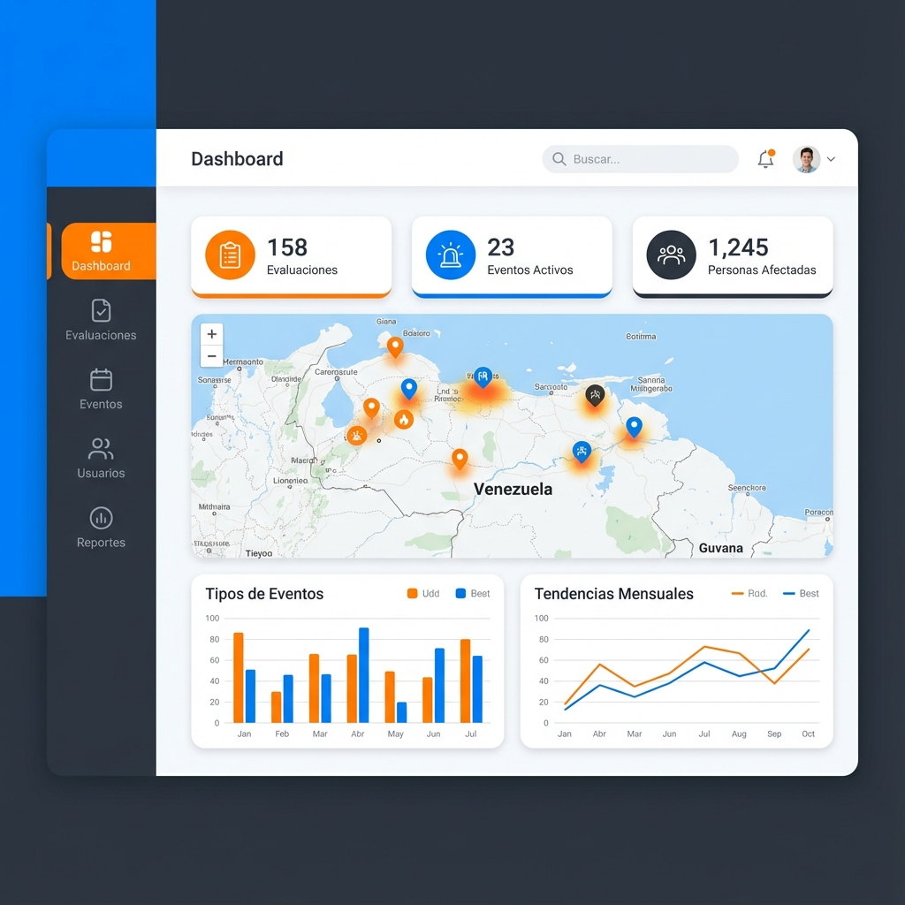

# 🚨 EDANOS - Sistema de Gestión EDAN

<div align="center">



**Sistema Integral de Evaluación de Daños y Análisis de Necesidades para Venezuela y el Mundo**

[](https://github.com)
[](https://github.com)
[](LICENSE)

[Características](#-características-principales) • [Tecnologías](#-tecnologías-utilizadas) • [Instalación](#-instalación) • [Uso](#-guía-de-uso) • [Contribuir](#-contribuir)

</div>

---

## 📋 Tabla de Contenidos

- [Descripción del Proyecto](#-descripción-del-proyecto)
- [Problema que Soluciona](#-problema-que-soluciona)
- [Características Principales](#-características-principales)
- [Tecnologías Utilizadas](#-tecnologías-utilizadas)
- [Arquitectura del Sistema](#-arquitectura-del-sistema)
- [Capturas de Pantalla](#-capturas-de-pantalla)
- [Instalación](#-instalación)
- [Guía de Uso](#-guía-de-uso)
- [Estructura del Proyecto](#-estructura-del-proyecto)
- [API y Documentación](#-api-y-documentación)
- [Contribuir](#-contribuir)
- [Créditos](#-créditos)
- [Licencia](#-licencia)

---

## 🎯 Descripción del Proyecto

**EDANOS** es un sistema informático completo, originado en Mérida, Venezuela, diseñado para modernizar y automatizar la gestión de **Evaluaciones de Daños y Análisis de Necesidades (EDAN)** por parte de los organismos de Protección Civil a nivel nacional.

El sistema integra tres componentes principales que trabajan en sincronía para proporcionar una solución completa de gestión de emergencias:

### 🎨 Visión y Misión

#### Visión

Ser la herramienta tecnológica estándar a nivel nacional para la gestión de información en desastres, unificando y fortaleciendo las capacidades de Protección Civil en toda Venezuela.

#### Misión

Empoderar a los organismos de Protección Civil de toda Venezuela  con una plataforma digital robusta que optimice la evaluación de daños y el análisis de necesidades, permitiendo una respuesta más rápida y coordinada y lo mas importante ayudar de una manera mucho mas rapida a toda cumnidad que lo necesite.

---

## 🔥 Problema que Soluciona

### Situación Anterior

Antes de EDANOS, el proceso de evaluación de daños presentaba múltiples desafíos:

- 📝 **Formularios en papel** - Proceso lento y propenso a errores
- 🐌 **Retraso en la información** - Datos tardaban días en llegar a las oficinas centrales
- 📊 **Análisis difícil** - Imposible obtener estadísticas en tiempo real
- 🗺️ **Falta de visión general** - No había forma de visualizar geográficamente los eventos
- 🔄 **Duplicación de esfuerzos** - Información fragmentada entre diferentes organismos
- 📉 **Respuesta ineficiente** - Decisiones basadas en información desactualizada

### Solución con EDANOS

✅ **Recopilación inmediata** - Los datos llegan en segundos desde el campo  
✅ **Centralización nacional** - Información de todo el país en un solo lugar  
✅ **Análisis en tiempo real** - Gráficos y estadísticas actualizados automáticamente  
✅ **Visualización geográfica** - Mapa interactivo con todas las evaluaciones  
✅ **Toma de decisiones informada** - Datos actualizados para distribuir recursos  
✅ **Respuesta coordinada** - Sincronización entre diferentes niveles de gobierno

---

## ⭐ Características Principales

### 📱 Aplicación Móvil (Campo)

- ✅ Formularios EDAN digitales completos
- ✅ Captura de fotografías y geolocalización GPS
- ✅ Modo offline con sincronización automática
- ✅ Firma digital del evaluador y afectado
- ✅ Selector de eventos activos
- ✅ Validación de datos en tiempo real
- ✅ Compatible con Android e iOS

### 💻 Plataforma Web (Oficina)

- ✅ Dashboard con estadísticas en tiempo real
- ✅ Tabla de evaluaciones con búsqueda y filtros avanzados
- ✅ Mapa interactivo de Venezuela con marcadores
- ✅ Gráficos y visualizaciones de datos
- ✅ Sistema de gestión de eventos
- ✅ Generación de reportes en PDF
- ✅ Gestión de usuarios por seccionales
- ✅ Sistema de roles y permisos

### 🔧 Backend (Servidor)

- ✅ API RESTful completa
- ✅ Comunicación en tiempo real con Socket.IO
- ✅ Autenticación JWT segura
- ✅ Base de datos PostgreSQL con Prisma ORM
- ✅ Upload de imágenes a AWS S3
- ✅ Sistema de notificaciones
- ✅ Logs y auditoría

---

## 🛠️ Tecnologías Utilizadas

### Frontend Web

```javascript
React 18          - Framework UI
TypeScript        - Tipado estático
Zustand           - Gestión de estado
React Router      - Navegación
Recharts          - Gráficos y visualizaciones
Leaflet           - Mapas interactivos
Socket.IO Client  - Tiempo real
```

### Aplicación Móvil

```javascript
React Native      - Framework multiplataforma
Expo              - Toolchain y servicios
TypeScript        - Tipado estático
React Hook Form   - Formularios
WatermelonDB      - Base de datos local
Socket.IO Client  - Sincronización
Expo Location     - Geolocalización
Expo Camera       - Captura de fotos
```

### Backend

```javascript
Node.js           - Runtime
Express           - Framework web
Socket.IO         - WebSockets
Prisma            - ORM
PostgreSQL        - Base de datos
JWT               - Autenticación
AWS SDK           - Cloud storage
Bcrypt            - Encriptación
```

### DevOps & Tools

```bash
Git               - Control de versiones
Docker            - Contenedores
PM2               - Process manager
Nginx             - Reverse proxy
```

---

## 🏗️ Arquitectura del Sistema



### Flujo de Datos

1. **Evaluador en campo** completa formulario en app móvil
2. **Datos se envían** al backend vía HTTP/WebSocket
3. **Backend procesa** y almacena en PostgreSQL
4. **Notificación en tiempo real** a la plataforma web via Socket.IO
5. **Dashboard actualiza** automáticamente con nuevos datos
6. **Coordinadores visualizan** información y generan reportes

---

## 📸 Capturas de Pantalla

### Aplicación Móvil



_Interfaz de evaluación móvil con captura de datos en campo_

### Plataforma Web



_Dashboard administrativo con estadísticas y mapa interactivo_

---

## 📦 Instalación

### Prerrequisitos

- Node.js 18+ y npm
- PostgreSQL 14+
- Git
- (Opcional) Docker

### 1. Clonar el Repositorio

```bash
git clone https://github.com/tu-usuario/edanos.git
cd edanos
```

### 2. Configurar Backend

```bash
cd backend
npm install

# Configurar variables de entorno
cp .env.example .env
# Editar .env con tus credenciales

# Configurar base de datos
npx prisma migrate dev
npx prisma generate

# Iniciar servidor
npm run dev
```

### 3. Configurar Frontend Web

```bash
cd frontendpc
npm install

# Configurar API URL
cp .env.example .env
# Editar VITE_API_URL con la URL de tu backend

# Iniciar aplicación
npm run dev
```

### 4. Configurar App Móvil

```bash
cd edan1.2
npm install

# Configurar constantes
# Editar edan1.2/confg/constants.ts con tu API_URL

# Iniciar con Expo
npx expo start
```

---

## 📖 Guía de Uso

### Para Evaluadores (App Móvil)

1. **Iniciar sesión** con credenciales de Protección Civil
2. **Seleccionar evento activo** del selector
3. **Completar formulario** EDAN con datos del afectado
4. **Capturar fotografías** de la situación
5. **Firmar digitalmente** evaluador y afectado
6. **Enviar** - Los datos se sincronizan automáticamente

### Para Coordinadores (Plataforma Web)

1. **Acceder al dashboard** y ver estadísticas generales
2. **Consultar mapa** para ubicación de evaluaciones
3. **Filtrar evaluaciones** por evento, municipio, tipo
4. **Generar reportes** en PDF
5. **Gestionar eventos** activos y archivados
6. **Administrar usuarios** y permisos

### Gestión de Eventos

Los eventos permiten agrupar evaluaciones por desastre específico:

```typescript
// Ejemplo: Crear un evento
{
  nombre: "Inundaciones Mérida 2024",
  tipoEvento: "Inundación",
  estado: "Mérida",
  municipios: ["Libertador", "Santos Marquina"],
  estadoEvento: "activo",
  fechaInicio: "2024-11-27"
}
```

---

## 📂 Estructura del Proyecto

```
edanos/
├── backend/                 # Servidor Node.js
│   ├── src/
│   │   ├── controllers/    # Lógica de negocio
│   │   ├── routes/         # Endpoints API
│   │   ├── middlewares/    # Auth, validación
│   │   ├── services/       # Servicios externos
│   │   └── index.js        # Punto de entrada
│   ├── prisma/
│   │   └── schema.prisma   # Esquema de BD
│   └── package.json
│
├── frontendpc/             # Aplicación web React
│   ├── src/
│   │   ├── components/     # Componentes React
│   │   ├── pages/          # Páginas/vistas
│   │   ├── store/          # Estado global (Zustand)
│   │   ├── services/       # API client
│   │   └── App.tsx
│   └── package.json
│
├── edan1.2/                # App móvil React Native
│   ├── app/                # Screens (Expo Router)
│   ├── components/         # Componentes reutilizables
│   ├── hooks/              # Custom hooks
│   ├── services/           # API y Socket
│   ├── context/            # Context providers
│   └── package.json
│
└── docs/                   # Documentación
    ├── images/            # Imágenes y diagramas
    └── README.md          # Este archivo
```

---

## 🔌 API y Documentación

### Endpoints Principales

#### Autenticación

```http
POST /api/usuarios/loginMovil
POST /api/usuarios/login
POST /api/usuarios/solicitar-registro
```

#### Evaluaciones (EDAN)

```http
GET    /api/edan              # Listar todas
POST   /api/edan              # Crear nueva
GET    /api/edan/:id          # Obtener por ID
PUT    /api/edan/:id          # Actualizar
DELETE /api/edan/:id          # Eliminar
POST   /api/edan/upload       # Upload imágenes
```

#### Eventos

```http
GET    /api/eventos           # Listar todos
GET    /api/eventos/activos   # Solo activos
POST   /api/eventos           # Crear evento
PUT    /api/eventos/:id       # Actualizar
PATCH  /api/eventos/:id/cerrar # Cerrar evento
```

#### WebSocket Events

```javascript
// Cliente emite
socket.emit('nuevaEvaluacion', evaluacionData)
socket.emit('actualizarEvaluacion', evaluacionData)

// Servidor emite
socket.on('evaluacionCreada', (data) => {...})
socket.on('evaluacionActualizada', (data) => {...})
```

### Documentación Completa

Para documentación completa de la API, consulta:

- [Documentación de Eventos](../README_GESTION_EVENTOS.md)
- [Implementación de Código](../IMPLEMENTACION_EVENTOS_CODIGO.md)
- [Análisis del Sistema](../ANALISIS_GESTION_EVENTOS.md)

---

## 🤝 Contribuir

¡Las contribuciones son bienvenidas! Si deseas contribuir a EDANOS:

### Reportar Bugs

Abre un issue describiendo:

- Descripción del problema
- Pasos para reproducir
- Comportamiento esperado vs actual
- Capturas de pantalla si aplica

### Solicitar Features

Abre un issue con:

- Descripción de la funcionalidad
- Casos de uso
- Beneficios esperados

### Pull Requests

1. Fork el proyecto
2. Crea tu rama (`git checkout -b feature/AmazingFeature`)
3. Commit tus cambios (`git commit -m 'Add: Amazing feature'`)
4. Push a la rama (`git push origin feature/AmazingFeature`)
5. Abre un Pull Request

### Convenciones de Código

- **JavaScript/TypeScript**: ESLint + Prettier
- **Commits**: Conventional Commits (feat, fix, docs, etc.)
- **Branches**: feature/, bugfix/, hotfix/

---

## 👨‍💻 Créditos

### Creador y Desarrollador Principal

**Gabriel Osuna**  
Desarrollador de Software y ex-funcionario de Protección Civil Mérida

- 🎓 Experiencia técnica en desarrollo full-stack
- 👨‍🚒 Conocimiento profundo de procesos de gestión de riesgos
- 💡 Ideó y desarrolló el sistema completo desde cero
- 🏆 Combinó experiencia operativa con habilidades técnicas

### Reconocimientos

Este proyecto fue desarrollado combinando conocimientos técnicos con experiencia real en el campo de Protección Civil, resultando en una herramienta que verdaderamente resuelve las necesidades de los organismos de respuesta a emergencias en Venezuela.

---

## 📜 Licencia

Este proyecto está bajo la Licencia MIT - ver el archivo [LICENSE](LICENSE) para más detalles.

---

## 📧 Contacto

Para consultas, soporte o colaboraciones:

- **Proyecto**: EDANOS - Sistema de Gestión EDAN
- **Autor**: Gabriel Osuna
- **Website**: [https://edanos.osunadigital.lat](https://edanos.osunadigital.lat)

---

<div align="center">

**⚡ Desarrollado con pasión para Venezuela por Gabriel Osuna ⚡**

_Modernizando la gestión de emergencias en todo el país_

</div>
